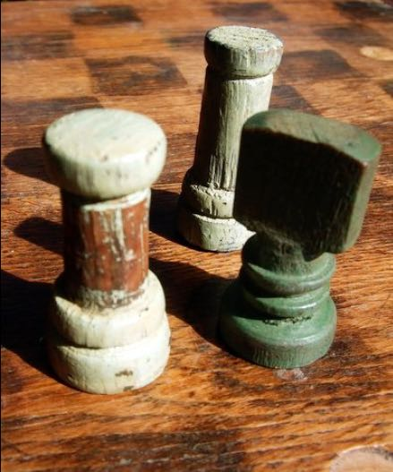

## A 20th Century German Immigrant to Texas

### By Mark B. Wieser

Fredericksburg, Texas
February 1, 2014

> Work is the crown of life and brings satisfaction.
> **James 1:**

All rights reserved including rights of reproductions. No part of this book may be used or reproduced in any manner without written permission of the Author, except in the case of brief quotations embodied in critical articles and reviews.

Copyright Pending © 2014

ISBN 978-0-615-97097-

Printed in the United States of America

https://books.google.com/books?id=H-53ngEACAAJ&source=gbs_navlinks_s

# Introduction

I always felt that my father was decidedly different from most fathers, but not because I knew a lot of other fathers from which to make this assessment. I respected his accomplishments not only because of what he did for his family, or because of his determination to succeed, or his tenacity to weather any obstacles, but also because I knew him to be above reproach, absolutely honest, and committed to his beliefs, among them that what one studied and learned cannot be taken from one. He was a visionary and often outspoken but possessed an inane ability to see solutions to problems his peers could never match. He was a thinker and  never one who was afraid to say what he believed even if it meant being scorned by his contemporaries. He refused to compromise his principles or his integrity. I recognized from an early age that one had to be old enough to earn a right to engage in a meaningful conversation with him. He was 52 when I was born. He aged considerably as I grew up in the 1950s. I never really had that meaningful conversation. I was lectured to often, but what I might have been able to contribute to any discourse assuredly did not matter to him. As all children of German fathers, I did as I was told, I listened, and I kept quiet. I had asked a few questions about his life in Germany, but had not yet engaged him in a serious dialog before he died suddenly just short of his 72nd birthday.

I was not close to my father, for I, along with most of my siblings, feared him. He never took me hunting or fishing. He never took me to see a sport game. It never occurred to me that fathers even did such things with their sons. Nor did it ever occur to me to ask that of him. He seemed beyond approach although I now suspect that he might have felt honored to have been asked.
Of course, he may never have taken any of his children on a solo journey, for if we went fishing, we went fishing as a family out to the farm or to the lake. And I was by far the youngest of his five children. However, I was never the less quite proud of him for what he had tried to accomplish for the county. He was always brutally honest and expected no less of me or my older siblings. Each built their own relationship with him. I was also seven years younger than my closest sibling in age. All of them were long gone when I began to realize who my family really was. I grew up primarily as an only child with parents who were more like grandparents.
I tried not to cause them too much trouble.

Our father expected us to do our very best at school and to strive to educate ourselves to be able to earn a good living, but
he did that, along with my mother, without having to verbalize it. It was something that we simply understood. All through junior
high I never exhibited any inclination to study and made only fair grades. My seventh grade reading teacher laughed out loud when I
mentioned going to college. Remarkably little was said to me regarding my poor performance in school. Perhaps he knew that I
would one day wake up and take by education seriously. That turning point occurred my freshman year in high school. That
September of 1955 I was introduced to a family of high school teachers most of whom had taught all of my siblings. It was a clear
message that much was expected of me.

The life our father or mother led could never have been described as being a bed of roses but as a struggle to survive. Life
was a serious endeavor. I cannot now recall anyone aged thirty or more at the time I was growing up that ever smiled. They all
seemed angry all the time. Only through hard work and frugal living, one void of any luxury or convenience, could one hope to
succeed and survive. Moreover, we were told that the key to all this was through education and saving every dime one earned.
Having learned the value of an education himself, our father made higher education a priority and possible for of each of his five
children. My mother, who was denied her chance finish school, wholeheartedly agreed even when at times it denied her many labor-
saving devices she would have appreciated to have had in her home. No daughter of J. B. would simply be allowed to become just a
secretary; no son, just a farmer. Strangely, none was encouraged to enter business or taught the value in investing in land or
borrowing money or engaging in ventures outside their chosen careers. We were given no allowance, and the only time I dared asked
for money to go to a movie, I was denied even 50¢, the price of a movie ticket at that time.[^1] I resolved never to ask again just as I
had in the second grade after learning how needing a pair of white pants for a May Pole dance had upset my mother. Only savings
mattered and we were all taught that money costs money. Later, those who borrowed money from him or our mother paid interest
until fully repaid. That was expected, but not thought to be unreasonable. Ironically, the financial investments that my father made
outside of his profession were not taught to us.

We listened as a captive audience, but one in awe, to his stories at family gatherings around the dinner table as he related
adventures of growing up in Germany. If we had done any of those things we would have been severely beaten. He told of serving
in the Kaiser’s army and of the occasion on which his unit marched in review of the Kaiser himself. He told of his early experiences
in and around Hico, Texas where in trying to learn to drive he drove a car off a bridge. And he told many stories of his vision for
Gillespie County for which he had tried to lead during difficult times at the height of the depression. But he suffered his defeats in
silence by eventually withdrawing unto himself. Yet he was comforted in his own mind in knowing that he had always done what was
right. He never indicated that he might have had regrets. His contemporaries simply did not appreciate him nor could they
understand his wisdom. The community, for which he had made so many personal sacrifices, working long hours while holding his
elected positions, never returned its appreciation or acknowledged his contributions that made their lives better. The paved highways
and bridges that make day trips to Fredericksburg possible today are hardly given a second thought today as two million tourists
descend on the county in any calendar year. But in the mid-thirties, the county was still truly isolated from the larger metropolitan
centers of the state and the thought of having good, paved roads remained highly doubtful as the depression lingered longer than
expected. The best access in and out of Fredericksburg remained via a severely underfunded railroad teetering on bankruptcy. And a
host of archaic laws and regulations restricted the speeds of trucks and limited the tonnage each could haul. But things were changing
and J.B. saw opportunities in which the county could play a leadership role.
Although at first, J. B. dove into community organizations to become known, he was not a joiner of clubs for the purpose
of socializing. His vision for Fredericksburg and Gillespie County, however, were rejected by established community leaders as each realized that he was a threat to their status and their personal needs for recognition. Outside of a few good acquaintances, he neither
sought nor made friends. None ever came to visit at his home. He never went out on a night with the boys. Despite his love and
the challenge offered by a game of skat he never played with the local club. He did not bowl, was not a fan of local baseball, and
despite his love of water he never swam in the city’s first pool on Goehmann Lane. His love was sailing and when he finally dared to
take some time for himself he built a sailboat to haul over to the new lake forming on the Colorado River. (Lake Buchanan) But the
timing was bad and his interest in that faded with the advent of rationing during the Second World War. He later limited his activities
to an occasional game of skat with his neighbors, but in my lifetime I can count only on two such nightly occasions. For almost a
third of his remaining life he was essentially a loner and spent many long hours on the farm where he could be alone with his
thoughts and reflections. His only satisfaction came from an unsolicited comment from loyal clients who occasionally related to him
that they had heard others somewhere say, “We should have listened to old man Wieser when he was county judge.” When he died
many came forward to express their concerns that they did not know how what they would do now that he was gone.
Occasionally, when a student project was required of me the story of his life became a favorite project of mine for I already
knew that I had a dad with an interesting background. These gave me the opportunity to ask him questions about his youth and his
life growing up in Germany. He seemed to gather some satisfaction simply in knowing that someone had bothered to ask.
Remarkably, not a soul in his adopted community ever bothered to ask him about his native country. After listening to stories told at
the end of meals, I knew something of his life in Germany before he immigrated to America. Had I known then what I discovered
later, I could have asked far more questions and done so much more probing. Unfortunately, I was simply too young to know to ask
the right questions. As all children reared in strict German families, I learned to listen mostly in silence.
My father died when I was 19. I was beginning my second year at Texas A. &amp; M. College. I had changed my major from
chemistry to history and chosen German as a minor. My decision to major in chemistry had been a disaster, but I never told my dad
or thought to ask for his advice. I never brought a single personal problem to him and I doubt if any of my siblings did either. I had
never thought to do that. He might even have been pleased to have learned that I had chosen to study German.[^2] He might have
asked what I planned to do with it. That he permitted each of us to choose a profession that we liked was also remarkable. Perhaps
he thought that we might all come around one day to making the right choices at our own pace.

Three of the remaining chess pieces and the chess board made by J.B. [^3]

I was home from college only a few weekends before his death in late October 1960. I was already half way through my fall
semester in a new degree plan of which he knew not a thing. Following that last Sunday’s lunch, he challenged me to a game of chess
as my mother and I sat out on a front porch where I was waiting for my ride back to College Station. He had taught me to play the
game many years before on a chessboard he had made himself and with chess pieces he had turned on the lathe he had installed in a
shop we affectionally called "the hothouse."[^4] I accepted the challenge; of course, I knew I had no choice. But I played with a solid
determination to win, and I did in a long, well-fought match. As he resigned, he gathered his pipe, his matches, and his George
Washington pipe tobacco and commented upon leaving the room that he had noticed that I always played much harder when I
played against him than when I played against others. I acknowledged his words for he was right, of course; I had. I wanted to beat
him, for to defeat a master was an accomplishment. And I knew that my win had pleased him. It was one of the few times that I can
honestly say that he might have been somewhat proud of me.
Our Christmas in 1960, our first family gathering without him, was very different, for the driving force behind the family
was clearly gone. Nevertheless we carried on the tradition of singing songs before handing out our gifts that Christmas Eve as we
had done all our lives. My sisters took their turns on the piano. As always, we sang _Old Black Joe_ ,[^5] his favorite, for one last time
before opening our presents. Thereafter, we never sang it or any Christmas songs again on Christmas Eve ever again. That family tradition, insisted upon by him, died that year and for some unknown and unspoken reason, we all sensed that evening that no Christmas thereafter would ever be the same.

It was also during that holiday season that I decided to write to his sister Anna, our aunt, in Germany even as I struggled
with finishing several term papers. I had met his brother Ernst only once in the summer of 1955 in Arkansas. He returned to Texas
with us and spent a few short days in Fredericksburg. But my interest that Christmas was in contacting my aunt. She and my uncle
had simply never been the topic of any discussion as far as I can remember. The absence of that had never struck me as being
unusual. We regularly received a beautiful German Christmas card from overseas and my father received, like clockwork, a birthday
card from his sister every year but seldom anything from his brother in New York. I do remember that following the end of the
Second World War that we had sent one or two CARE packages[^6] to his sister in Germany, but none since the late forties. It had
never occurred to me to ask questions about his brother or his sister. What an experience it would have been had I been given a
chance to spend a summer or part of a summer with him in New York City in the mid-1950s. I doubt that my father would have
permitted it considering what I now know about their relationship, but nevertheless to have been able to do so would have been
stunning. Of course, I simply never thought to ask questions about either my uncle there or my aunt in Germany and nothing was
ever mentioned about them in private or during any of those after-dinner stories which he told on holidays and on some Sundays.
And what J. B. and Stella spoke to one another of Ernst and Anna is also unknown. I do remember, however, the sheer joy that
shown on my father’s face upon seeing his brother for the first time in more than a quarter century. I thought it was wonderful.
I had taught myself to write the old German script and in January of 1961 I penned my first introductory letter to my aunt,
“Tante Anna.”[^7] I received a reply in a matter of weeks and so began eleven years of letter-writing between us. It led directly to us
making our first trip to Europe in 1964, the year following my graduation from college. I had to borrow the money to do so, but the
experience changed my outlook in incomprehensible ways. My oldest sister, Jeanette, organized and planned the trip for she had the
most experience in traveling. Since being a young teacher on her own, she had taken annual trips each summer to explore the United
States with friends. We followed her advice without questioning and with the help of Europe on Five Dollars a Day we proved that
one could really see Europe that cheaply.[^8] My mother and another sister, Imogene, decided to go to Germany as well. In Tuttlingen,
Germany, where my widowed aunt lived, we were introduced to her children and her grandchildren, none of whom we had ever
known to exist and did not even know of their names. We were welcomed with such warmth as never before experienced by us.
I bonded particularly well with my aunt and only to a lesser extent with her son-in-law Rudi, the husband of her daughter
Lieselotte. Rudi had one of the most beautiful handwritings I have ever seen. With him I spent hours asking questions and receiving
extended discourses on events not only of Germany, but on history, his experiences during the Second World War and politics, and
also about my family, my father, and grandfather. Of course, it is again with deep regret that I did not do more questioning at the
time. My aunt and I began a correspondence that lasted until her death in 1971, albeit our exchanging letters grew less frequent with
time. I thought that I was as close of a confident to her as one could expect. After all, I had been the one who had asked her so
many questions about my father and of the Wiesers and of the Buhls, my dad’s mother’s family. And Rudi had helped me in getting
the family tree from the priest in Volkertshausen. Opening the pages of those old, dusty church books, some dating long before the
17 th century, running my fingers over the entries that had so carefully been made by the various village priests assigned to this small
village from time to time, and seeing the names of my ancestors was thrilling beyond words. None of this would have been possible
had it not been for the connections that Rudi, who had studied for the priesthood, had made within the Catholic Church. On a
recent attempt to see those records a second time, I was informed that all such church records are now housed in Freiburg and
simply no longer available to the general public. I realized that I had been very fortunate.

In the summer of 1966, our Tante Anna finally came to the United States. She first spent a few weeks with her brother
Ernst who lived in New York and with whom we had spent a few days upon our return from our trip in 1964. She eventually made it
to Texas where she spent the vast majority of her six months in America, first, with a lengthy stay in Fredericksburg, then some
weeks in Huntsville, made a day trip or two to Austin, and finally some time in Texas City. She experienced, that summer, living as
we had always lived with an occasional day trip to points of interest. We showed her as much of Texas as we could when we were
free from our various jobs. As a family we celebrated her birthday by traveling to Monterrey, Mexico, where mariachis serenaded her
on her sixty-seventh birthday and she tasted real Mexican food for the first time. We took her to Hico, Texas, where she met the
daughter of Vincent Wieser, whom she had once met at the age of 13 on Vincent’s homecoming to Germany in 1910. None of us
had ever met any of these Wiesers although we knew of them through stories told by our father. Anna experienced the new Six Flags
in Dallas, the battlefield of San Jacinto, the Alamo in San Antonio, the capitol in Austin, and the Strand in Galveston, where J.B. had
landed more than half a century before. Most of her time was spent in Fredericksburg where she busied herself braiding a rag rug for
my new apartment in Seguin, planting her beloved flowers in my mother’s yard, and settling in to a long, hot summer visiting with my
mother’s friends, most of whom she could easily converse in German. She loved the farm and marveled at the vast amount of space
we enjoyed in America and came to understand her brother’s love for this land. On Sundays I drove her to Mass in my Model T.
We thought we were showing her how it was to live in America. Only years later would I learn that she had been receiving a far
different opinion of life in the United States from her brother in New York. She never revealed that other view to me. She also
spent much of her time writing letters home about what she was experiencing among us and in Texas, and obviously reflecting on her
brother and his strange American family.

It would be remiss not to mention that, as with all company that extends its stay for too long, there were some unpleasant
occasions. My mother, particularly, was not happy with the things we did for my aunt, for her upbringing had caused her to suffer
much insecurity at times. Perhaps she took offense that we appeared to dote on our Tante Anna. Nor did my brother sense much
appreciation for establishing a closer relationship with her. My brother, who had been in practice with my father for the last decade
of his life, may in his conversations with him, have formed a different opinion toward his relatives in Germany. Perhaps he resented the rest of the family showing so much affection toward our aunt when such affection was never shown our father. He was probably
correct. As the oldest, he had had much more time to build that relationship with him than had those of us who followed. Anna
wrote home of the resentment that she felt and I had much to explain many years later of how it was at the time. As a whole,
however, our aunt’s visit to America was chocked full of adventure, and she took home many, many wonderful memories. Anna
returned to Germany in the fall of that year, and she and I resumed our correspondence as did two of my sisters, but invariably I was
called upon to translate each letter and card before they answered them.

I returned to Germany to spend Christmases in 1968 and 1970. That Christmas was the last time that I would see my aunt.
Her health was failing her, for she had fallen and was living with her daughter in Dürbheim [^9] while recovering. She died in 1971, after
which time my correspondence with her family diminished considerably. In the following decades, my sister Jeanette returned to
Germany from time to time and maintained a better correspondence with our aunt’s daughter, Lieselotte, than I did. I was, in my
naivety, simply too busy to keep up the correspondence.

It was during Jeanette’s return to Germany in 1992 that Lieselotte asked her if she had any interest in our father’s letters.
Lieselotte explained that she just did not know what to do with them and thought Jeanette might want them. Imagine my surprise
when Jeanette brought to me all the letters that our father had written home since immigrating to Texas in 1914. There, wrapped in a
plastic sack, were slightly more than a hundred handwritten and typed letters. In a quick inspection, I could see that those dated quite
early were in his handwriting, a small precise, highly disciplined German script that one would expect from a bookkeeper. While I
could, with considerable effort, read German script, I felt I did not have the time then to read them. Consequently, I put them in a
bottom drawer of a dresser where they remained for the next five years, very much forgotten. In the spring of 1998, I decided it was
time for me to translate and read them all. After sorting them by date I began to enter them into my computer. Learning to read my
father’s handwriting in the German script was not that difficult, but it took me a while to learn his particular style. Having taught
myself how to write German script more than three decades before, I was finding that it was now coming in quite handy. By typing
what letters and words that I could identity on the screen I could begin to correct my spellings of obscure letters revealed what words
he had intended. His German was, of course, flawless. It was a sign of his education. [^10] In the days and weeks that followed a story
began to unfold that was for me nothing short of astounding. Each day another letter became another chapter of an unfolding saga
of a seemingly endless adventure in America. I could hardly wait to translate the next before heading off to work. Here, from these
old letters, emerged a father I had really never known, but in a larger sense I did know this man and I began understand his feelings
perhaps more than any other member of the family.

I thought that I had enjoyed a great rapport with my aunt, but why she had never shared the existence of these letters with
me will remain a mystery and one for which I am at a loss to explain save to say that she probably correctly understood that I was still
far too immature to have them at the time she still lived. I was simply overjoyed that her daughter had thought of giving them to my
sister some twenty-one years after our aunt’s death. As I finished the last, I felt a need to make them available to my sisters and my
father’s grandchildren, but sadly I felt that they would be of little interest to others, although I hope that as they are read hereafter a
true image of who their father and grandfather was.

I knew much of what had happened throughout the years covered by the letters and began to think about complementing
the letters with those events, especially those events I remembered as having been important to us at the time. However, like all good
intentions, the project was set aside. Again, I felt that I had to concentrate on other things. Then, more than half a decade later,
business took me to Germany in 2005. I was on my way to Munich but managed to squeeze in time for a short visit to see my
cousins in Stuttgart and Tuttlingen whom I had not seen in many years. While visiting Lieselotte, I asked more random questions
about their thoughts on my father for I had intended to take a year to write what I felt needed to be told around each letter.
(Certainly, I felt a year to be sufficient.) Meanwhile, near the end of that first evening she casually mentioned that her mother had
kept all of her brother’s letters from America as well. Would I like to see them?

It was almost midnight as she placed a large, battered notebook on her kitchen table that was obviously filled with hundreds
of letters written by our uncle, Ernst. They chronicled his life in New York City just as those that her mother had given my sister
chronicled my father’s life in America. I could not believe my eyes. I took the notebook to bed and read as many of the letters as I
could, thumbing through them looking for those that might have mentioned my father. Even those few that I came across were eye-
openers! I knew then and there that I needed copies of them all. What else could they reveal to me about my father? What could
they tell me about his relationship with his siblings? I needed to know. How would they fit in with my father’s letters? I wanted to
know. The next morning I inquired about making copies, but it being Sunday, nothing would be open and there was no time left. I
was leaving in the morning. I asked if her son could email them to me. After being assured she would do that, I proceeded on to
Munich and then back home where I waited weeks for the first of the letters to arrive. Finally, in late spring, Eckard, the son of
Lieselotte’s brother, Ernst, who lives in Stuttgart, emailed me about a dozen letters. For days I waited for more. No more came.
Finally inquiring of any problem, I was assured that those were all there were. I knew that to be wrong, but chose not to argue. I
resolved to return the next year, purposefully this time, to have them all copied.

That next summer I returned to Germany and was relieved to discover that I had not deceived myself. There was the
notebook with its entire content of tattered letters. Copying them, however, proved again not to be that simple. If one has ever had
to deal with German relatives, one quickly realizes that they want you to do it their way. I would not be allowed to simply copy them
at a nearby office supply. No, Lieselotte insisted that we take them to see her daughter in another village which lay some one and half
hours away. That was planned for the very next Sunday. Her husband was the village doctor there and had a clinic. The clinic had a
copier. So, I waited anxiously until the day came to travel there and to spend the day with her daughter, Sabina, and her husband,
Günther. Consequently Günther and I spent the better half of that Sunday afternoon copying page after page of Ernst’s letters. It
was a great experience, for I did get to know her husband quite well. There were over 200 letters consuming over 450 pages. They 
dated from 1930 to his death in 1983 - over half a century of correspondence. Unfortunately the letters from the first years of
Ernst’s immigration to Mexico and Texas were missing, about a decade’s worth. I began to wonder why.
My father, of course, kept none of the letters he received from home, and upon reflection, I realized that was truly a loss.
None of the birthday or Christmas cards survived either. Lieselotte also mentioned that our grandmother, Maria, had burned a
number of letters, but she was unsure of the reason or whose she burned. I am now more inclined to believe that she burned more
of those from my uncle, Ernst, that she did of her first born’s. In fact, I am certain of it now that she had burned none of my dad’s
letters. The long lapses in writing between Anna and my father are easily explained as their letter writing resumed each time after an
extended absence. There probably were no other letters that were written during those lapses. Unfortunately, the letters my
grandmother burned were probably all letters Ernst had written from his years in Mexico, the year that he spent in Fredericksburg
with my father and mother, those remaining years he spent upon his return to Mexico early in 1925, and his first years in New York
upon his reentry into the United States in 1928. It is impossible to understand my grandmother’s motives for burning those letters.
Sadly I was left with no clue as to what Ernst might have experienced in Mexico and only a hint of what his first year living with J.B.
and Stella on the farm had been like. Ernst was a prolific writer and described everything. I could have learned much of those
missing years.

Meanwhile, I have also concluded why my father refused to write home after 1921. The reason had to be that once again
his advice was not being followed. He proved to have little patience with those who refused to listen to him. The drought of letters
lasted at least thirteen years before it was somewhat and obviously only reluctantly resumed in 1935. To this day that gap and his
refusal to write to his mother and sister will have to remain a mystery. Although their writing eventually resumed it was regulated to
that of an annual ritual. Gone were the anticipation of Anna and their mother learning what J. B. was experiencing in Texas. He
revealed very little thereafter.

I packed the copies of Ernst’s letters consisting of almost an entire ream of paper carefully. Along with them my laptop and
placed both into one of my suitcases for my trip home. However, upon arrival in San Antonio, I discovered that my luggage had not
accompanied me home. One suitcase was missing, and I left the airport believing that my laptop had been too much of a temptation
for bag handlers to resist. Fortunately, the airline called the next day to announce that the missing suitcase had been found and
assured me that it would be delivered. As it turned out, everything was intact, including the laptop and all the copies. Everything was
there. I breathed a sight of relief. I would not have to return to Germany again, at least not soon.
Now, I set out to do what I had done with my father’s letters. After sorting them by date, I began to translate each as I
found the time to do so. As in my father’s case, Ernst’s early letters were handwritten and were the most difficult to decipher, for his
handwriting was not that of a skilled bookkeeper who might have taken great care in creating each letter of a word. Thankfully both
brothers later made good use of typewriters which made translating much easier. During World War II, my uncle reverted to
handwriting when Americans were asked to write on airmail paper envelopes that could be folded saving weight. His handwriting
was decidedly less legible than even before and made translating much more difficult. Nevertheless, as with my father’s letters, an
interesting saga began to emerge. It contrasted vividly with my father’s experiences of adjusting to life in America. Finding time to
digest and work on so many letters proved more challenging than I had imagined. I did it as I found time — early mornings and late
at night. By late summer I had translated them all. As I headed to Bali for a vacation, I took them with me on a flash drive and for
two weeks, uninterrupted; I sat on the beach and reworked them once again.

Ernst’s letters told a quite different tale. There was no America that emerged from his letters with an unlimited bounty of
opportunity. Quite on the contrary, there was only an America run by Jews and special interests. He wrote only of an America where
it was impossible to get ahead no matter how hard one tried. And an America where there was a definite need for the rise labor
unions, and an America that needed to be socially changed and her ruling class destroyed. Ernst’s view of America contrasted vividly
with that of my father’s. I began to understand why the two had not grown close.

The letters also sadly revealed a life of an endless series of disappointments and failed opportunities. Their story was a tale
of two brothers who were never able to reconcile their differences even as one stood at death’s door. Through my uncle’s letters, I
learned some interesting and frank assessments of my father. Ernst was not ashamed to write his difficulties to their sister in
Germany. Likewise, my father’s assessment of his brother to his sister had often been shocking and blunt. The letters now clearly
reveal why there was so little contact between them. However, the letters are not only so much about each other as they are about
America and the experiences of each. But most striking was that two pictures of America emerged. One was an America of
opportunity where success was achieved through education, hard work, and sacrifice. The other was an America described as a place
where it was impossible to get ahead because the system and those in charge of it were purposely keeping people in their place. It
was truly a perfect example of whether one sees a glass of water half full or half empty. More remarkably, my aunt never revealed to
me or my sisters what the one had said of the other. It was regrettable that one brother could not simply be a brother without
continuously assessing the faults of the other and that the other constantly complained of the actions of the first. All those wasted
years and missed opportunities revealed a very sad tale.

After finishing the translations, I was forced to reflect on what I had learned. I suggested to Lieselotte that for all those
years, her mother and grandmother had been receiving a story of two very different versions of what America was really about. How
had they managed not to question either? How had they managed not to reveal their thoughts to us as we began to renew our
relationships in 1964? The letters still leave much unsaid.

In order to tell the tale of my father, I felt a need to include events that were happening in both the United States and in the world;
especially those of which I know my father had a decided interest. Whether verbally expressed or not I know what events meant
something to my dad and mother at the time. Both brothers described events quite accurately, albeit if frequently, fleetingly and modestly. Having known my father for barely the last two decades of his life, I felt that I could add some creditable descriptions of what was happening during that time as well as supplement with stories I heard told at those many family gatherings. I mention only those events that I remember as being important at the time for one or the other. Now, more than half a century after my father’s
death his predictions for America are standing a greater chance of coming true than ever before. If he could return today, I firmly
believe that he would question even to a greater extent whether there exists today as much opportunity for fulfilling one’s dreams as
on that 15th day of March, 1914, when he stepped ashore in Galveston and discovered a whole new world of opportunity lay before
him.

Fredericksburg, Texas – February 1, 2014.

### Footnotes

[^1]: I actually did ask once again when after my freshman year at Texas A&amp;M., the  I had received from a United States savings bond appeared not to cover my expenses 
    for my first year. I was pointedly told to use my own money, money from my share of the money that my brother and I had earned from the sale of wool and mohair from the flocks that he had sold us.

[^2]: I received the lecture of my life in 1957 from my father. The Soviet Union had just launched Sputnik, the world’s first artificial
    satellite. The Russians appeared to be ahead of the United States in space and leaving American in the dust. Thinking that one might
    be prepared for a conflict with the Soviet Union, I volunteered to my father that I was thinking about studying Russian in college.
    My father had a way of raising his eyebrows and reigning back his ears when rising to anger, which, by the way, caused his glasses,
    which were often raised to sit on the top of his head, to fall down to his nose as if coming to attention. I knew that I was in trouble,
    and he proceeded to lecture me on the value of studying German, not Russian; for the next hour. Needless to say, I minored in
    German at Texas A & M College and took advanced German classes at the University of Texas. I also taught German, something
    that had never crossed my mind at that age.

[^3]: J.B. turned this chess set on a lathe in his hothouse workshop. The chess board he made from a board which at one time had been bolted to some sort of office equipment. 
 These three pieces are all that survived. These and the board are in the possession of M. Wieser, Fredericksburg, Texas.

[^4]: **The Hothouse** to our family was a room J.B. had built along the south wall of the garage he had also built on the property that he had purchased on the San Antonio highway. 
    It consisted of walls of nothing, but windows, most of whose panes were broken or missing in all three walls, but if it ever served as a garden hothouse, it did so long before I came into this world. It was basically a shop, cluttered with piles of junk that grew from the dirt floor up to about waist high. One could find anything in them to fix or repair whatever had broken. Searching through them was an adventure that occupied many of my hours as a youth, whether on a rainy afternoon or on a hot summer day. It is very likely where I acquired my joy for antiques. There were early boxed versions of radios, gears and parts from old Model Ts, aluminum Dodge Bros. hub caps, old tire tubes, and pieces of all sizes of lumber. Along the north wall, the same being the south wall of the garage stood a long, high worktable to which a hand grinding stone forsharpening knives and axes was attached. Parts were covered with thick black oil and grease. At the east end a hand operated grinder was attached used for sharpening axes and knives. On the table lay a huge heavy cogged gear wheel which served as J.B.’s anvil. A single tool chest, probably no larger than 12” by 18”, hung over the center of the bench. It contained what bits J.B. used for his brace. On the far west end, a lathe was bolted that was operated by a motor that sat unsecured in a frame secured to the rafters and tethered by pulleys to the lathe. Here J.B. fashioned a chess set of his own design. From one end to the other were scattered tools and additional remnants of old cars. Nothing was thrown away. Even a set of bowling pins and two balls were found among the items stored there. The hothouse and the garage were demolished in 1984.

[^5]: **Old Black Joe** was written by Stephen Foster and reflected upon a time of innocence etched in his memory. The figure Joe, whom Foster portrayed as an elderly slave, embodied          Foster’s sentiments about his experiences as one goes through life. These lyrics were dear to J.B. - 
     [http://www.liucedarswampcollection.org/template1/blackjoehomesweet.html](http://www.liucedarswampcollection.org/template1/blackjoehomesweet.html) - accessed July 25, 2010.

[^6]: **CARE Packages** consisted of food and clothing that were gathered by Americans and mailed to relatives in Germany following the close of the Second World War. - 
    [http://www.care.org/about/history.asp](http://www.care.org/about/history.asp) - assessed July 25, 2010.

[^7]: **Tante Anna** is German for Aunt Anna. Tante Anna was also the name of a popular German-American folk song often aired on 
    Fredericksburg’s local KNAF Radio during their 1950s Polka Hour which was broadcast daily after noontime.

[^8]: Arthur Frommer’s book actually worked for us. I remember once renting room in a Gasthaus in Germany for .25. Our greatest fear before getting there was wondering how we were going       to survive on a “continental breakfast,” for the book warned us that outside of England and Holland, Europeans confined their meals to nothing but coffee and pastry or rolls. We         ere used to a large breakfast. To our surprise the bread and jams were wonderful and plentiful and the coffee much better than at home. - 
        [http://www.nbcnews.com/id/18401888/ns/travel-destination_travel/t/europe-dollars-day/#.UvZpmmJdXp0](http://www.nbcnews.com/id/18401888/ns/travel-destination_travel/t/europe-dollars-day/#.UvZpmmJdXp0) – accessed February 8, 2014.

[^9]: **Dürbheim** is a small rural village slightly north of Tuttlingen, Germany. There Tante Anna’s son-in-law taught elementary school and lived in the third floor of the village Rathaus or city hall.

[^10]: I was soon able to translate and understand what he was writing with amazing clarity. However, after deciphering specific sentences or paragraph, 
    I felt it necessary as a translator to rewrite them to convey their meanings better. I felt entitled to take the liberty of expressing his text as it would be said in English.
